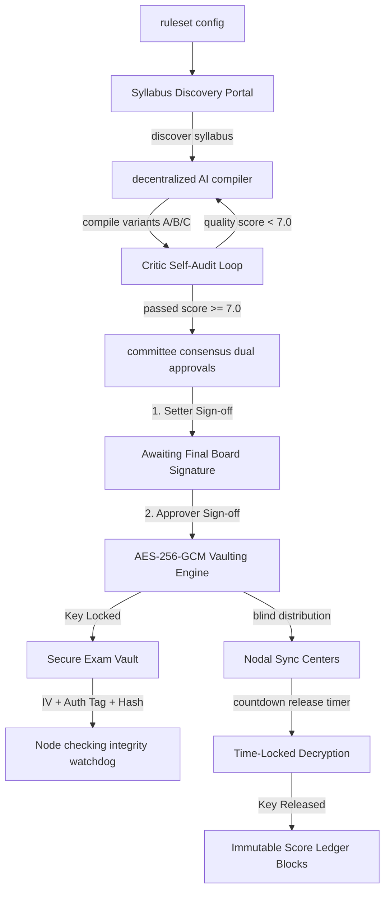

# 🔒 Zero-Trust Exam Security Agent
### *Autonomous Cybersecurity Infrastructure for National Examination Leaks Prevention*

[](https://react.dev/)
[](https://vite.dev/)
[](https://tailwindcss.com/)
[](https://openai.com/)
[](https://supabase.com/)

---

## 🌟 The Problem & The Solution
**Physical paper leaks, human distribution vector theft, and database modifications** cost millions of students their careers every year. 

The **Zero-Trust Exam Security Agent** is an autonomous cybersecurity pipeline designed to eliminate human leak vectors. By taking human access tokens out of the equation, the system blindly compiles, audits, encrypts, and distributes national exam papers (like JEE, NEET, and CBSE) using decentralized AI agents, client-side cryptography, and immutable ledgers. **Total Human Clicks required = 2 Signatures Only.**

---

## 🧬 Core Architecture & Data Flow



---

## 🚀 Key Features

### 1. 📡 Blind Scraper Syllabus Discovery
Pulls syllabus topics directly from official boards (NTA, CBSE, SSC, etc.) in real-time, removing human curriculum tampering.

### 2. 📝 Decentralized AI Paper Compiler
Generates three variants (**A, B, and C**) of 5-question examination papers blindly based on scraped parameters using **OpenAI GPT-4o**.

### 3. 🔍 Critic Agent Self-Audit Loop
An auditor agent scans all generated questions for syllabus compliance, plagiarism against historical papers, difficulty distribution, and redundant items. **If the quality score drops below 7.0/10.0, the pipeline automatically triggers a complete compiler regeneration loop.**

### 4. ✍️ Dual Human-in-the-Loop Consensus Signatures
Two independent roles (**Committee 1: Setter** and **Committee 2: Approver**) must verify the digital credentials and sign off before encryption keys are released.

### 5. 🔑 Client-Side AES-256-GCM Encryption
Papers are encrypted client-side using browser-native cryptography (`window.crypto.subtle`) with a random 256-bit symmetric key, producing a secure ciphertext, initialization vector (IV), and authentication tag.

### 6. 🛡️ Database Integrity Watchdog
Recalculates the SHA-256 hash of the vault database records every 10 seconds. If a database injection attack or unauthorized modification is detected, **the watchdog activates a system-wide lockdown and triggers a visual & audio breach siren**.

### 7. ⏳ Time-Locked Release Ticker
Decryption keys remain locked inside the cryptographic vault until the exact start window. Local distribution nodes download blind encrypted packets which can only be opened once the synchronized UTC time release is achieved.

### 8. 🧬 Mutation Spacing Forensics (Leak Tracer)
Every center receives papers with distinct layout spacing mutations and synonym configurations. If a physical paper is leaked via camera, scanning the layout instantly reveals the leak origin (e.g., *Center B - Mumbai*).

### 9. 🔗 Immutable Score Ledger
An append-only score ledger chaining transactions using SHA-256 hashes (`Genesis -> Block 1 -> Block 2`). Any attempt to modify scores in the database breaks the chain, raising tampering alerts.

---

## 📂 Project Structure

```
├── public/                 # Assets & icons
├── src/
│   ├── components/         # Premium Cyber UI Components
│   │   ├── ActionButtons.jsx    # Autonomous Autopilot & step console
│   │   ├── AdminView.jsx        # Database inspector tabs
│   │   ├── Dashboard.jsx        # Dynamic header, UTC clock, ECG pulse
│   │   ├── LiveProcessLog.jsx   # Live system telemetry feed
│   │   ├── OfficialExamPaper.jsx# Bilingual exam preview sheet
│   │   ├── PhasePanel.jsx       # 9-Phase progress checklist
│   │   └── RobotMascot.jsx      # Interactive AI TTS voice mascot
│   ├── lib/                 # Core logic, encryption, evidence capsule
│   │   ├── encryption.js        # AES-GCM & SHA-256 web crypto wrapper
│   │   ├── evidenceCapsule.js   # Audit trail evidence exporter
│   │   ├── openai.js            # GPT-4o generator and critic audits
│   │   └── supabase.js          # Supabase client with smart local fallback
│   ├── pages/               # Views for Setter, Approver, & Admin
│   ├── App.jsx              # Routing & global reactive states
│   └── index.css            # Tailwind custom theme variables
```

---

## ⚡ Quick Start

### 1. Clone & Install
```bash
git clone https://github.com/pallavithulkar/Zero-Trust-Exam-security-agent2.0-.git
cd Zero-Trust-Exam-security-agent2.0-
npm install
```

### 2. Configure Environment (`.env`)
Create a `.env` file in the root directory:
```env
VITE_OPENAI_API_KEY=your_openai_api_key_here
VITE_SUPABASE_URL=your_supabase_url_here
VITE_SUPABASE_ANON_KEY=your_supabase_anon_key_here
```
> ⚠️ **Robust Fallback Mode:** If no credentials are provided, or if the keys are invalid, the app automatically runs on a **high-fidelity client-side local database simulation (localStorage)**. You can test the entire workflow with zero-config!

### 3. Run Development Server
```bash
npm run dev
```
Open **[http://localhost:5174/](http://localhost:5174/)** in your browser.

---

## 🛡️ Security & Compliance
- **Authenticated AES-256-GCM** (Galois/Counter Mode) preventing ciphertext tampering.
- **SHA-256 Cryptographic Hash Chaining** for the immutable score ledger.
- **Row-Level Security (RLS)** emulation enforcing write-once read-only policies.
- Fully compliant with **ISO/IEC 27001** guidelines for information security management.
